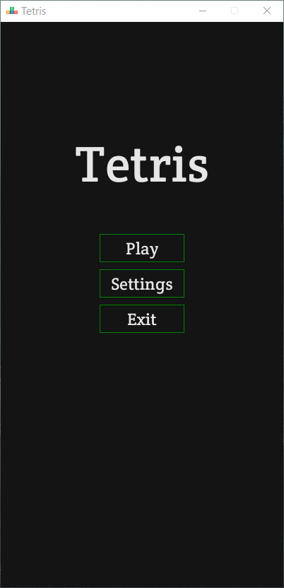
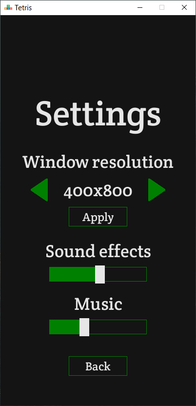
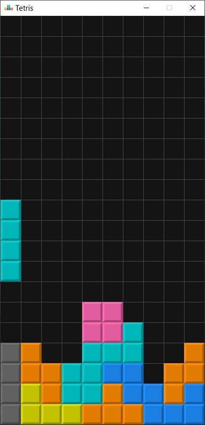
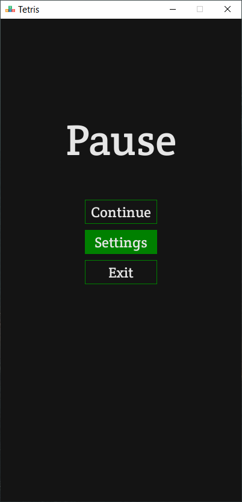
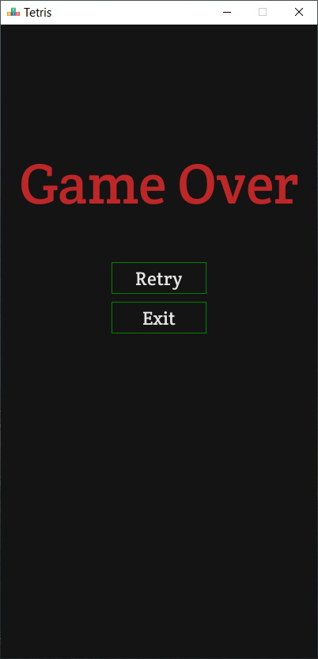

# About
The game was developed using SDL2 and C++20.
The game has a simple menu with the following tabs: "Play", "Settings" and "Exit".
In the settings you can change the screen resolution and adjust the volume of music and sound effects.
The game ends when the playing field is full. The speed of falling figures is constant and does not increase over time. The game has different sound effects when several lines with figures are deleted. The game also includes several compositions that play during the game.

## Controls
<table>
    <thead>
      <tr>
        <th>Action</th>
        <th>Key</th>
      </tr>
    </thead>
    <tbody>
      <tr>
        <td>Move left / right</td>
        <td>KeyLeft / KeyRight</td>
      </tr>
      <tr>
        <td>Move down</td>
        <td>KeyDown</td>
      </tr>
      <tr>
        <td>Rotate</td>
        <td>KeyUp</td>
      </tr>
      <tr>
        <td>Drop</td>
        <td>Space</td>
      </tr>
      <tr>
        <td>Swap figure</td>
        <td>C</td>
      </tr>
      <tr>
        <td>Pause</td>
        <td>Esc</td>
      </tr>
    </tbody>
  </table>

# Screenshots

  
  
  
  
  

